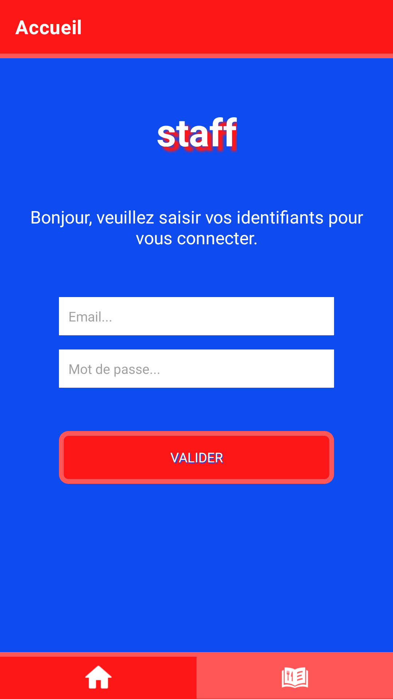
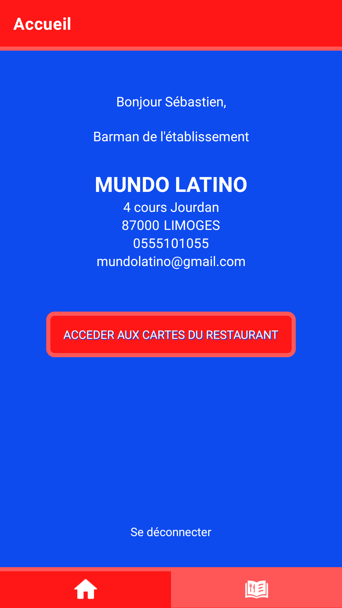
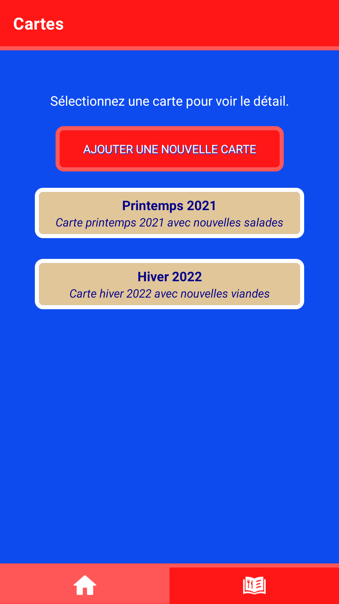
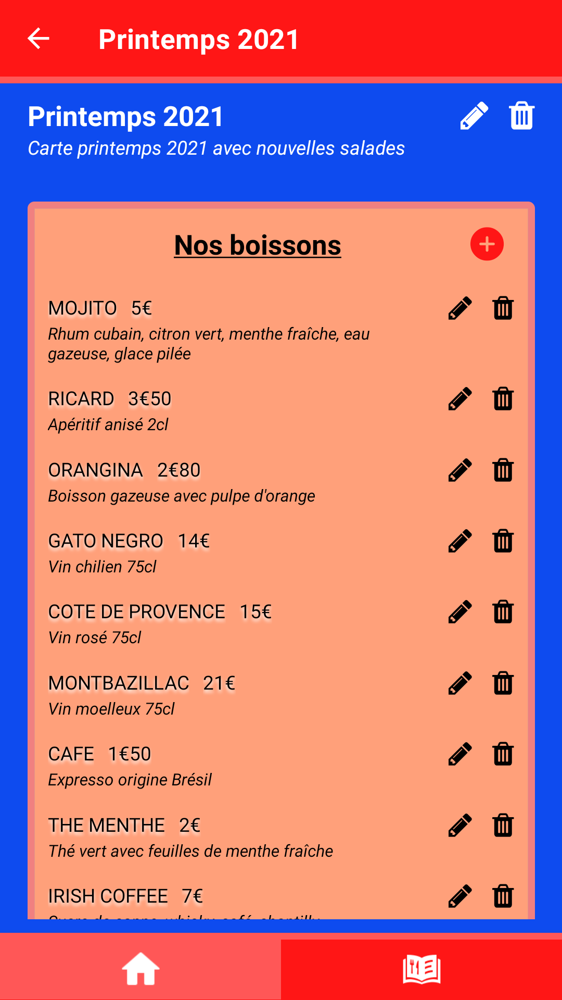

# Staff Front Native

  
  
  
  

  
## Table of contents

* What is Staff Front Native ?
* How does it work ?
* Stack

### What is Staff Front Native ?

Staff Front Native is a Case Study project for restaurant staff.  

You can consult all restaurant cards and create a new one.  

You can consult detail of each card and update card informations.  

Finally, you can delete a card.

### How does it work ?

Install expo, clone this project and lauch expo start.

Ask me email and password to connect you.

Once you are logged, you can browse the app.

Enjoy your Staff Front Native.

### Stack

